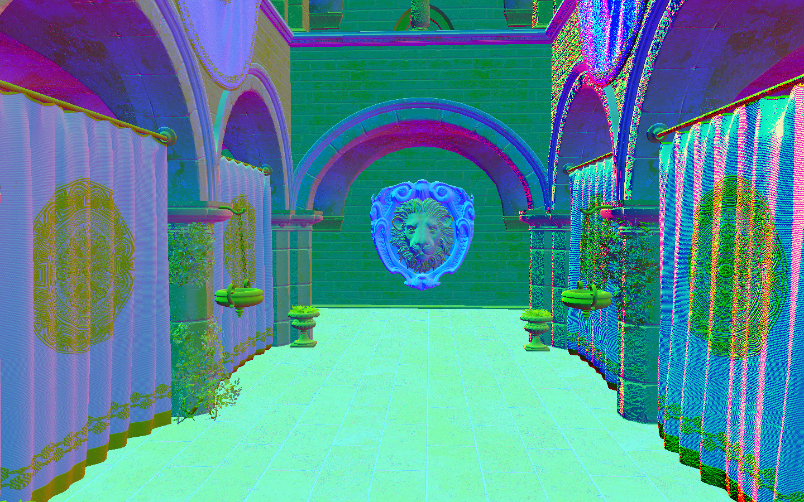

# PBR Vulkan Renderer

Renderer made using Vulkan 1.3, utilising own [vulkan wrapper library](https://github.com/OleksandrHlebov/vulkan-classes)

# Features

* **Camera**
* **Support for PBR materials**
* **Dynamic rendering**
* **Bindless rendering** featuring dynamic descriptor counts for GPU-side arrays
* **Deferred rendering** currently consists of:
    * **Depth prepass** with alpha cut-out
    * **GBuffer generation** with compact encoded normals
    * **Lighting pass** that renders to HDR image
    * **Blit pass** tonemapping HDR to LDR, physics based camera exposure
* **Lighting** featuring point lights and directional lights, with pregenerated during initialisation shadows maps for both.
* **Pool queries** used to acquire GPU timings to display for profiling purposes

# Screenshots

### Point lights

### Directional light

### Material image featuring encoded normals

- Encoded normals (.rg values)
- Roughness (.g value)
- Metalness (.a value)

# Libraries used

[vulkan-classes](https://github.com/OleksandrHlebov/vulkan-classes)

A Vulkan API wrapper featuring modern c++ features, includes:

- [**vk-bootstrap**](https://github.com/charles-lunarg/vk-bootstrap)

- [**GLFW**](https://github.com/glfw/glfw)

- [**Vulkan Memory Allocator**](https://github.com/GPUOpen-LibrariesAndSDKs/VulkanMemoryAllocator)

[**assimp**](https://github.com/assimp/assimp)

[**GLM**](https://github.com/g-truc/glm)

[**stb**](https://github.com/nothings/stb) - Used stb-image for texture loading.

[**Dear ImGUI**](https://github.com/ocornut/imgui) - Used for displaying profiling data and configurations.

